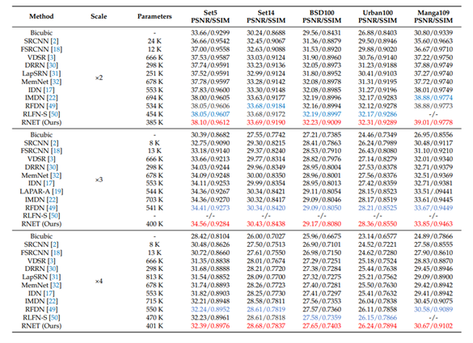
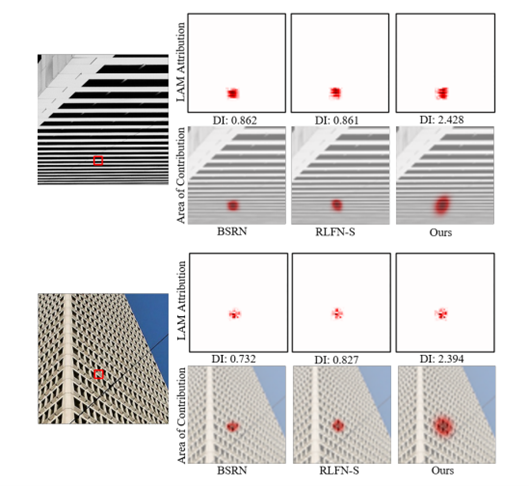
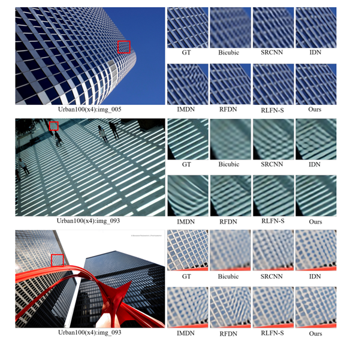

## 一种基于高效Transformer的轻量级图像超分辨率残差网络

**作者:** 严奉琦、李绍焜、周治国、时永刚

**发表时间:** 2024

**期刊:** Electronics

**链接:** [https://ieeexplore.ieee.org/document/10298797](https://doi.org/10.3390/electronics13010194)在线发表

**代码仓库:** [代码仓库链接]()

**相关资源:** [其他资源链接，如数据集、演示视频等]()

### 概要

- 近年来，深度学习方法在单图像超分辨率（SISR）领域取得了显著的成果。为了获得更好的性能，大多数现有的方法都集中在构建更复杂的网络，这需要大量的计算资源，从而大大阻碍了超分辨率技术的进步和实际应用。此外，许多轻量级超分辨率网络采用知识蒸馏策略来减少网络参数，这会大大降低推理速度。
- 为了应对这些挑战，我们提出了一种具有高效Transformer的残差网络（RNET）。RNET包含三个有效的设计元素。首先，我们使用蓝图可分离卷积（BSConv）代替传统的卷积，有效地减少了计算工作量。其次，我们提出了一个残余连接结构的局部特征提取，简化特征聚合和加速推理。第三，我们引入了一个高效的Transformer模块，以增强网络聚合上下文特征的能力，从而使恢复的图像具有更丰富的纹理细节。此外，空间注意力和通道注意力机制被集成到我们的模型中，进一步增强了它的能力。
我们在五个常用基准数据集上评估了我们的方法。通过这些创新，我们的网络在所有测试集上的性能都优于现有的高效SR方法，用最少的参数实现了最佳性能，特别是在图像纹理细节增强方面。

### 背景

- 随着深度学习和卷积神经网络的发展，人们已经意识到更深的网络可以大大提高恢复图像的质量。它们取得的显著成就部分归功于利用了以密集参数为特征的大尺度模型。然而，这种趋势导致了对超分辨率（SR）网络中的硬件资源的需求不断上升。这种资源密集性对SR技术的进展和现实世界的适用性施加了限制。
- 随着Transformer的出现，许多基于Transformer的图像恢复方法都取得了重大进展。然而，现有的基于transformer的超分辨率网络仍然面临着诸如过多的参数计数和缓慢的推理速度等挑战。
本研究的目的是提出一种基于卷积神经网络和Transformer结合的轻量化的高效单图像超分辨率网络。

### 关键贡献
- 我们提出了一个局部特征提取模块，使用了轻量化的BSConv和两个有效的注意力模块，并证明其在超分辨率任务中的有效性。
- 我们提出了一个高效的Transformer模块，增强了全局特征提取能力，同时不会显著增加计算复杂性。该模块有助于生成细节更丰富的重建图像。
- 我们提出了一个局部残差连接的结构，这不同于轻量化网络常用的特征蒸馏方法。该策略保证了信息高校流动，保持了较低的计算负担和较快的推理速度，并实现了出色的性能。

### 实验结果

- 实验表明，本方法在五个常用自然图像超分辨率基准数据集上都取得了最优结果。

 

- 同时，我们还对该模型进行了模型复杂度分析。实验结果表明，本研究提出的方法在具有最好的效果的同时具有最少的FLOPs以及次少的参数量。

  

- LAM结果显示，相较于主流轻量化超分辨率算法，本文方法具有最大的感受野，能够利用更大范围内的像素用做图像重建。

  
  
- 视觉效果显示，本文所提方法对于图像中的细节与纹理部分具有最强的重建能力，同时重建的图像具有最优的视觉效果。 
     

### 引用

- Yan, F.; Li, S.; Zhou, Z.; Shi, Y. A Residual Network with Efficient Transformer for Lightweight Image Super-Resolution. Electronics 2024, 13, 194. https://doi.org/10.3390/electronics13010194
