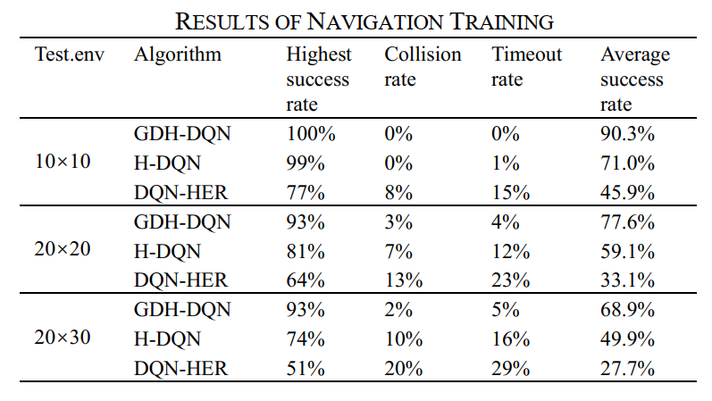

## 基于节点目标驱动的分层DQN避障算法自主场景探索研究

**作者:** 周治国、陈颖、于家宝、周学华

**发表时间:** xxxxxx

**期刊/会议:** xxxxxx

**链接:** [文章链接]()

**代码仓库:** [代码仓库链接]()

**相关资源:** [其他资源链接，如数据集、演示视频等]()

### 概要

- 在火星探测任务下非确定性的大范围导航环境中，环境状态多，行动空间大，只在目标点和障碍物处存在奖励的传统强化学习算法会出现奖励稀疏和维度爆炸问题，使得训练速度过于缓慢甚至无法进行。
- 本工作提出一种基于目标驱动的分层深度Q网络（GDH-DQN）的深度分层学习算法，该算法更适用于移动机器人的无地图探索导航避障。
- 该算法模型设计为两层，低层提供达到短期目标的行为策略，上层提供多个短期目标的选择策略。利用已知的位置节点作为短期目标，引导移动机器人前进，实现长期避障目标，使任务简化并分层执行，有效解决了奖励稀疏和维度爆炸问题。
- 算法各层均集成了事后经验回放机制来提高性能，充分利用节点的目标驱动功能，且有效避免复杂流程和奖励函数设计死角误导智能体的可能性。代理根据短期目标的数量调整模型层数，进一步提升了算法的效率和适应性。
- 实验结果表明，与分层 DQN 方法相比，GDH-DQN 算法的导航成功率显着提高，更适用于火星探测类未知场景。

### 背景

-  行星表面探测是深空探测领域中一个重大分支。要想更好地了解一个外星球，最好的办法是能够着陆其表面，完成巡视勘探。
-  行星表面漫游车车实际上是具有高度集成化、小型化、智能化的部分自主或全自主的行星表面移动机器人。漫游车自主探索行星场景，往往要求着其能够在多个节点间完成导航避障任务，并最终到达目的地。
-  面对难以预测的未知环境，移动机器人不仅需要能够到达指定位置，更需要合理地规划一条有效路径，避开障碍物成功到达各个节点目标并完成相应任务。
-  传统的导航算法必须依赖周围环境的可靠地图信息才能够保证规划的安全与有效，分块式的机器人规划方法，智能性较低，无法应对复杂环境。面对复杂密集障碍物规划效率大大降低，一定程度上限制了机器人漫游车的发展。
-  虽然强化学习技术可以在智能体与外部环境交互的过程中不断完善智能体的导航策略实现导航避障。然而将深度强化学习应用在机器人行星漫游车的导航中仍存在一些挑战。主要存在两个问题：一方面是因为只有成功实现目标才能获得奖励导致的稀疏奖励问题；另一方面是由于行星自主探索场景范围大导致算法在训练过程中出现维度爆炸的问题。这两点问题增大了DRL的训练难度，难以收敛到最优策略。

### 关键贡献

- 针对火星探测等大范围探索场景下无地图导航避障问题，提出了一种深度分层强化学习方法GDH-DQN。该方法可以解决大范围场景下奖励稀疏和维度爆炸问题。此外，可以对GDH-DQN进行扩展，解决各种未知复杂场景的探索问题。

- 将事后经验回放机制集成到分层强化学习算法，避免了复杂奖励函数的设计，充分挖掘了数据自身的潜能，有效提高了样本利用率，加速模型收敛。进一步解决了强化学习训练场景下的奖励稀疏和训练非平稳问题。

- 我们进行了大量的训练和测试实验，证明了GDH-DQN方法在大范围探索场景下的高性能和良好的适应能力。

### 实验结果

- 本文主要研究了基于深度分层强化学习的大范围火星探测场景机器人导航算法，设计了一种新型的深度分层强化学习方法GDH-DQN，将原本复杂的问题分解成多个子任务，不仅提高了样本利用率，同时改善了并行训练时存在的非平稳问题。
- 本算法以目标作为驱动，高层目标选择模型选取位置节点作为短期目标，低层避障控制模型为实现短期目标提供行为策略，引导机器人前进以达成长期的导航目标，每层均集成了事后经验回放机制提升算法性能。
- 本工作设计多种大小地图进行了实验，结果验证了本算法在大范围场景中导航优势。
  
- 实验数据表明，在最高导航成功率指标上，GDH-DQN算法与其他基础算法相比提高了超过30%，且值得注意的是，这种优势随着导航场景的范围不断增大越来越显著。
- 在较大的场景中，基础算法H-DQN和DQN-HER的平均导航成功率出现了明显下降，分别降至50%和28%，意味着这两种基础算法已经几乎无法实现有效的导航和避障功能。
- GDH-DQN在此复杂大场景中的平均成功率仍然维持在69%。这佐证了我们的算法在探索复杂导航环境时的高性能和强适应能力。未来，该算法通过适度的修改可以扩展到实际未知复杂场景的探索应用上。

### 引用

引用格式xxx
