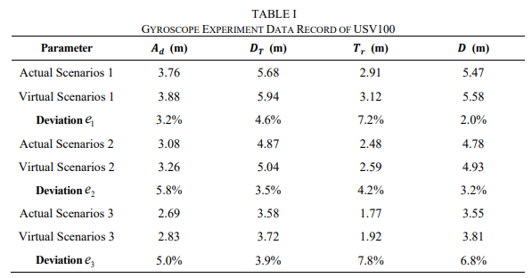
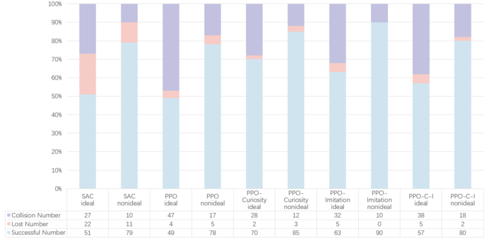
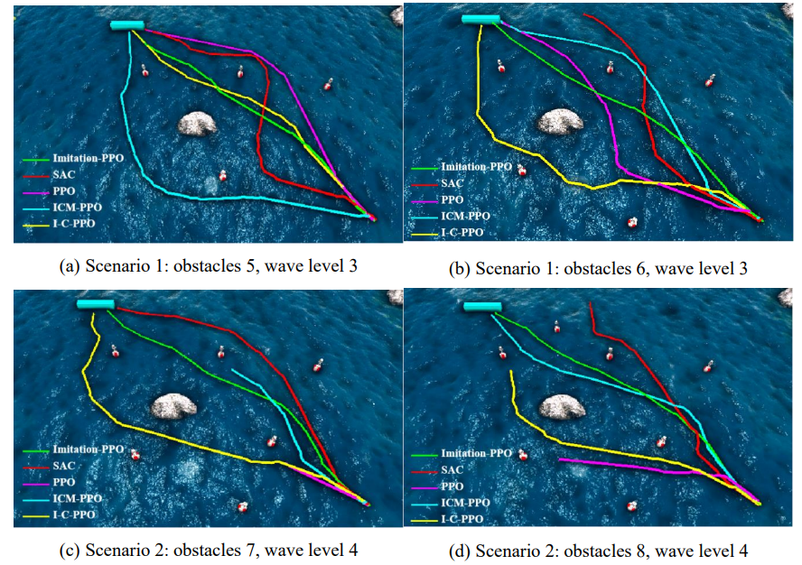
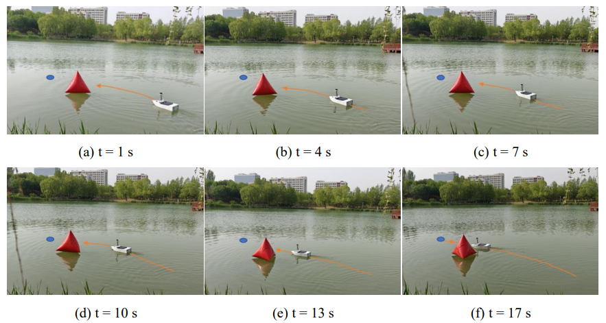

## 基于深度强化学习的数字孪生无人艇避障算法仿真训练平台

**作者:** 周治国、陈佳伟、祖博文、刘世棋、周学华

**发表时间:** xxxxxx

**期刊/会议:**xxxxxx

**链接:** [文章链接]()

**代码仓库:** [代码仓库链接]()

**相关资源:** [其他资源链接，如数据集、演示视频等]()

### 概要

- 深度强化学习训练平台中环境和智能体的构建对避障算法模型的应用性能有重要影响。目前的深度强化学习训练平台通常使用理想化的环境和粒子无人艇模型，未考虑无人艇和环境的动力学特性，降低了算法训练数据的维数，简化了智能体的奖励函数，导致避障算法模型难以在实际中应用。
- 本文提出了基于数字孪生概念的无人艇深度强化学习避障算法仿真与训练平台的设计。实现了避障算法的仿真、训练和性能评估，提供了从仿真训练到实际部署的框架。
- 为了验证环境仿真的真实感，进行了无人艇旋转和紧急制动实验。
- 通过调整海况高度和障碍物布局来评估无人船避障算法的有效性，并选择更有效的模型在真船上进行部署和测试。
- 实验表明，该仿真训练平台能够提供更接近实际环境的感知数据的深度强化学习算法。它可以有效地训练、测试和评估无人船深度强化学习避障算法。此外，所部署的算法对真船具有较好的泛化性。

### 背景

-  水面无人艇（USV）作为小型水上任务智能平台，具有灵活性高、智能化、隐蔽性好等特点。它们在水质评估、海岸线测绘、安全和救援行动等领域都有应用。
-  自主避障是USV智能的一个基本方面。由于无人潜航器的作业环境复杂，既受静态障碍物的影响，也受波浪、水流等移动障碍物等动态因素的影响，有效的自主避障对于成功完成任务至关重要。
-  深度强化学习（DRL）为无人艇导航和避障引入了一个新的维度，利用深度学习处理高维传感器数据，并利用强化学习进行决策和规划。DRL需要在USV代理及其环境之间进行大量的试错交互，以不断改进自我策略。由于在真实环境中使用物理设备进行训练时存在成本高、可控性低、可重复性有限、安全性不高等挑战，研究人员通常采用构建虚拟场景的方式在无人系统中进行DRL算法的训练和验证。
-  现有的培训平台在环境因素、agent模型、可视化等方面存在不同程度的不足。一些平台将航行场景理想化，忽略了风、波浪和水流等元素，而另一些平台则将USV过于简化为点模型，忽略了其运动特性。此外，现有平台通常依赖于损害可视化的基本模型。这些平台提供了与实际航行条件不同的数据，完成了算法训练和部分有效性论证。然而，在改进和训练算法时，调整仅限于这些环境和模型的范围，从而削弱了算法的实用性和泛化性。
-  数字孪生提供了一种连接物理和虚拟领域的方法，将现实世界的对象、过程或系统映射到它们的数字对应物上，从而实现无缝集成。虽然DRL为USV导航和避障铺平了新的道路，但Digital Twins可以在这个方向上提供重要的支持。

### 关键贡献

- 提出了一种基于深度强化学习的数字孪生无人艇避障算法仿真训练平台。通过将数字孪生概念引入平台设计，我们可以在虚拟环境中模拟各种复杂的任务场景，包括风、浪、流、动态障碍物等各种影响因素。它具有丰富的导航场景、逼真的运动仿真、良好的传感器仿真结果等特点，并为实船对接交互提供端到端的验证解决方案，使我们能够在更真实的环境中训练和验证深度强化学习算法。
- 该平台在导航场景构建中融入了数字孪生的思想，提供了高水平的精细化、高保真模型和良好的可视化结果。它可以提供复杂的天气环境，并可以为传感器提供与实际情况相似的数据。
- 该平台可以模拟风浪环境，计算作用在船舶上的力，提供船舶姿态变化信息，更好地模拟船舶在真实水域条件下的运动。
- 该平台提供各种模拟传感器，包括GPS、激光雷达、IMU和摄像头。每个传感器提供多个配置参数选项，可根据实际传感器进行配置。它还提供噪声模拟，以更好地模拟现实世界的数据条件。
- 该平台提供了一个从模拟训练到实际部署的框架，使基于ROS的算法能够快速部署。

### 实验结果

- 本文提出了一个用于数字孪生无人船深度强化学习算法的模拟训练平台。该平台解决了USV的理想化环境和简化的点质量模型导致的算法模型的性能较差和泛化能力有限的问题。模拟训练平台采用模块化设计理念，每个模块都表现出低耦合性，以便于未来的维护和升级。
- 在运动模拟实验中，USV在该平台上的运动数据与真实世界导航的偏差小于10%。这展示了反映客观运动模式的高度运动模拟精度。构建的虚拟环境和模拟传感器提供了与真实世界场景非常相似的数据，支持了模拟的准确性。在真实世界的部署过程中，各种算法的成功率与在虚拟仿真环境中获得的结果有很强的相关性。这表明，使用该平台在非理想条件下训练的算法可以在真实世界的场景中提供可比较的结果，从而展示出强大的泛化能力。

- 除了模拟USV运动，该平台还便于算法训练和验证。因此，为智能USV算法的研究和泛化性能的测试提供了一个稳健的基准。该平台的预期用户群包括无人水面舰艇领域的广泛开发人员。此外，它在最大限度地减少海上调试工作量、增强算法适应性和加快算法开发周期方面发挥着至关重要的作用。

### 引用

引用格式xxx
