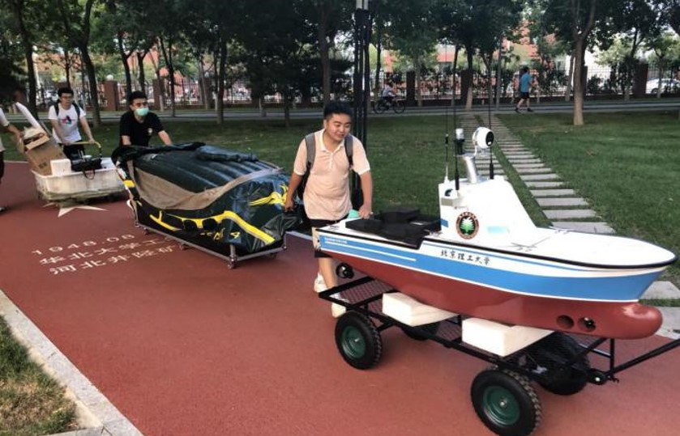
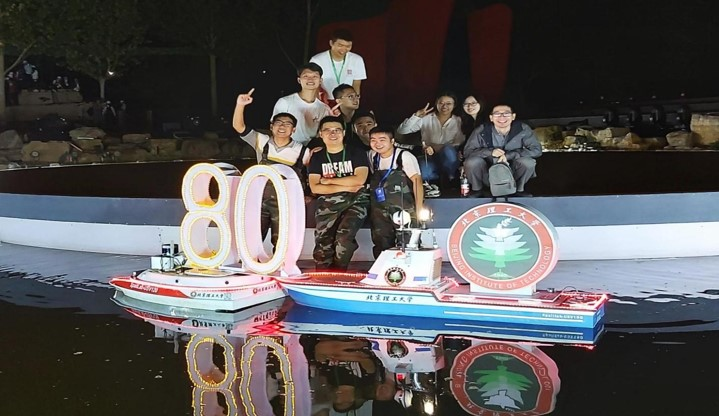

# BIT智能航行器俱乐部

## 建设背景

&emsp;&emsp;针对国家未来在海洋军事对抗中对信息融合感知、敌我定位识别、场景实时重构、立体机动协同等技术需求，建设基于无人船为节点的智慧海洋栅格信息平台，实现对水下、海面、空天的一体化透彻感知战场监控体系。

## 建设目标

- 构建海上环境感知与多源数据融合处理系统，建立水下和海面目标信息库与深度学习平台，支撑栅格信息目标检测、识别及跟踪研究；

- 构建基于无人船节点的大范围复杂场景的极化敏感多传感器实时仿真系统，支撑水下海面空天立体场景透彻感知系统虚拟场景构建研究；

- 构建无人自主平台的航行规划、编队组合、智能避碰等任务场景实时仿真系统，支撑动态攻防博弈下群体智能自主任务协同领域的研究。

## 俱乐部概况

指导教师三名：

|      | 姓名   | 职称职级   | 所属学院           |
| ---- | ------ | ---------- | ------------------ |
| 1    | 周治国 | 副教授     | 集成电路与电子学院 |
| 2    | 何冰松 | 高级实验师 | 集成电路与电子学院 |
| 3    | 周学华 | 实验师     | 集成电路与电子学院 |

&emsp;&emsp;随着国家对海洋科学研究的关注度提升，各类无人航行器竞赛不断增多，我们自行研制了智能无人船，不仅能培养学生独立思考的意识和发散创新思维的能力，在此过程中学生更能将专业理论知识运用到解决实际问题中。

&emsp;&emsp;立足新工科背景下，俱乐部为培养新一代的工程技术人才提供支撑和服务，希望将俱乐部建设为开放教学实践基地。

### 开放实验课

| 序号 | 课程名称                             | 起始年月 | 终止年月 | 授课对象(本/硕/博) | 听课    人数 | 主讲/助教 | 承担课时数 |
| ---- | ------------------------------------ | -------- | -------- | ------------------ | ------------ | --------- | ---------- |
| 1    | 开放实验课：智能无人船信息融合与导航 | 2019.7   | 2019.8   | 本                 | 14           | 主讲      | 32         |
| 2    | 开放实验课：智能无人船信息融合与导航 | 2019.10  | 2019.11  | 本                 | 15           | 主讲      | 32         |
| 3    | 开放实验课：智能无人船信息融合与导航 | 2020.10  | 2020.11  | 本                 | 5            | 主讲      | 32         |

### 取得成果

- 智海先锋 一等奖
- 扬帆起航 一等奖
- “深蓝寻猎”——水声体系化对抗视域下高速多航态无人平台设计  三等奖

