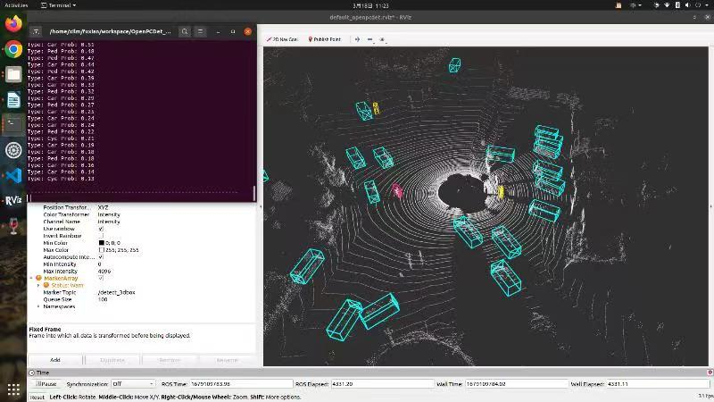

# 北京理工大学智能无人系统感知与导航实验室

**以虚实融合和具身智能为特点的无人系统感知与导航实验室**

## 实验室研究架构

## 研究方向

### 一、目标检测与感知

#### 多传感器融合目标检测

- 基于图像的2D目标检测算法 

- 基于多传感器融合的3D目标检测算法。 

- 目前正在研究相机-毫米波雷达-激光雷达的融合检测算法

#### 感知融合3D目标检测

- 利用双目相机和激光雷达获取的信息进行3D目标检测

- 将获取的信息以及检测结果发布到ROS平台上，以支持后续信息处理。

#### 恶劣环境下融合3D目标检测

- 多模态3D目标检测是当前自动驾驶领域的主流感知手段，它可以提供道路上的障碍物信息，供自动驾驶系统进行行动决策。

- 实际的行驶环境比较多变，雨雪等恶劣天气会导致感知算法的性能大大下降。
- 为了解决雨雪等恶劣天气对感知效果的影响，将天气的变化视为域偏移问题，采用域对抗网络的形式，在不依赖大量标注数据的条件下，实现提高恶劣环境下检测精度的目的。

### 二、强化学习运动控制

#### 无人船虚实融合训练系统

+ 基于unity搭建虚拟仿真训练环境

+ 基于马尔可夫决策设计避障任务

+ 基于深度强化学习算法和Pytorch深度学习框架训练模型

+ 基于ROS和C#通信机制实现虚实结合

+ 基于混合现实眼镜实现虚实融合展示

  

#### 无人车虚实融合导航避障算法

- 随着无人车技术的不断发展，智能巡检成为了许多领域中提高效率和降低人力成本的重要手段。无人车巡检系统可以在工业、城市、农业等领域中执行自主导航和巡检任务，检测和监控环境中的物体和设施。

- 无人车导航避障算法是实现智能巡检的核心技术之一。该算法能够帮助无人车在复杂的环境中规划路径、感知障碍物并进行避障，确保无人车安全、高效地完成巡检任务。
- 导航避障算法采用的是ROS+Unity的实验平台
- Unity进行仿真环境搭建
- ROS进行传感器的信息处理，用强化学习算法进行训练
- ROS和Unity之间采用ROS#和TCP-IP通信

#### 机械臂虚实融合运动控制算法
- 以实验室软硬件实验平台为依托，以ChatGPT定制用户与机器人的交互媒介。

- 基于计算机视觉算法捕获用户希望抓取目标物体的位姿信息，通过运动控制算法实现机械臂各关节的轨迹规划，最终达到机械臂自动抓取指定目标的效果。

### 三、SLAM建图与定位

#### SLAM高精度建图与定位算法

- 主要研究方向为移动机器人信息感知与导航，

- 通过激光雷达扫描的点云信息构建环境的3维地图，并将其用于导航，以解决机器人在未知环境运动时的定位与地图构建问题。

